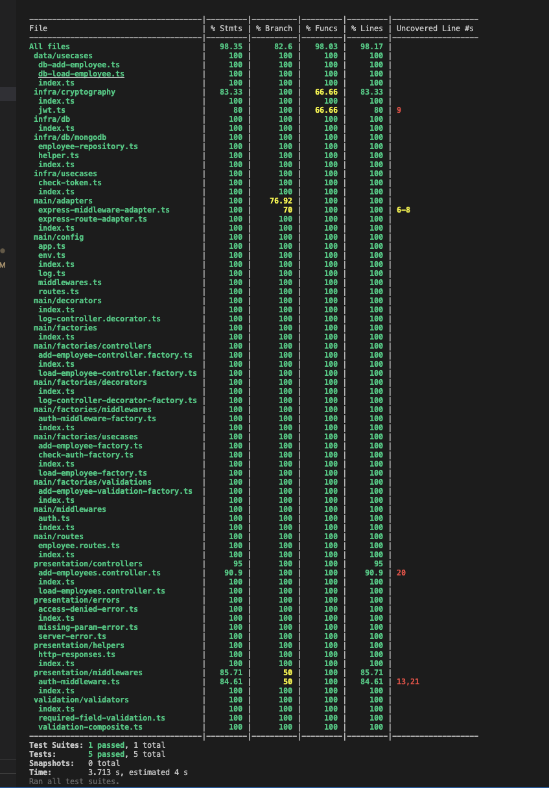

# Expreess Typescript API Clean Architecture

## Description
Hi, I hope you like this project, I wanted to show you how to implement a clean architecture for a NodeJs API using Express.

## Installation
1. Clone the project.
2. Copy `.env.example` to `.env`
3. Set env variables accordingly.
3. Run `npm i` in the project directory.
4. Run `npm start:watch` to run the service in dev mode.
5. Run `npm run test` for running the unit tests.

## API definitions

### 1. Employees endpoint
```
    GET /api/employees
        Headers:
            Authorzation: <JWT token>

    POST /api/employees
        Headers:
            Authorzation: <JWT token>
        Body:
            {
                "name": "Jose",
                "email": "jose@gmail.com"
            }
```
## Design patterns
1. Singleton
2. Repository
3. Decorator
4. Dependency injection
5. SOLID principles

## improvements

I build this project from the scratch and I believe there are some improvements that I need to do.

1. Improve unit testing for other layers like data, infra, domain, etc. I just implemented unit tests for the routes just to make sure everything works as expected.

2. Add Input validations.
3. Docker implementtion for deployment.
4. Add layer for graphql compatibility
5. Add endpoints to generate JWT tokens
6. Implement Swagger for API doc.

## Coverage
Some lines are not covered due I didn't implement an endpoint to generate a JWT, but it's almost 100% covered.
